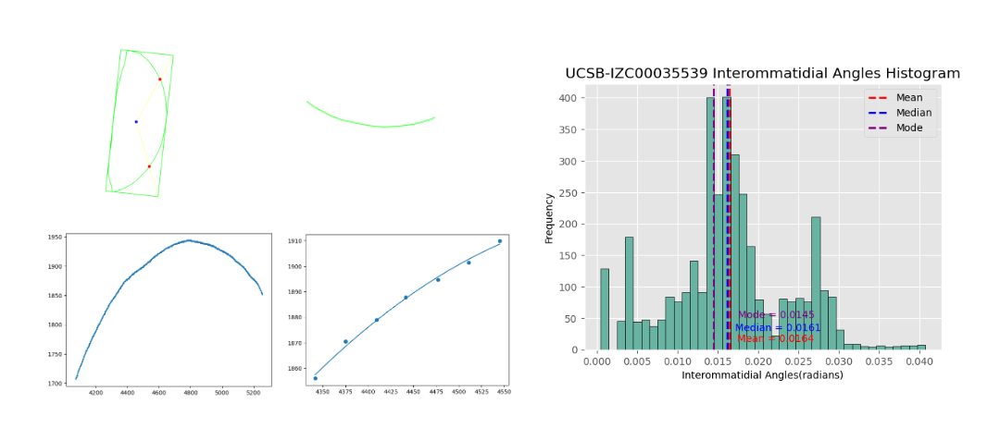

# Bee's visual Acuity Collection

Visual acuity, the ability to perceive detail, is ecologically important, as it dictates what aspects of a visual scene an animal can resolve. The study of visual acuity in bee species helps biologists understand their evolutionary history and gain insight into their foraging strategies and navigation abilities. Sponsored by the Caves Lab, this project aims to design a pipeline that uses high-resolution 2D photos taken by the NSF-funded Big Bee Project to estimate visual acuity across different bee species. In the pipeline, we develop algorithmic approaches to measure the diameter of the ommatidia $D$ and estimate the interommatidial angles $\phi$ on the eyeʼs surface. By achieving a significant level of automation and accuracy, our pipeline will facilitate more efficient data collection for biologists.

Our codes are updated based on the open-source code provided in https://github.com/jpcurrea/ODA, which is the offcial implementation of Currea, J.P., Sondhi, Y., Kawahara, A.Y. et al. Measuring compound eye optics with microscope and microCT images. Commun Biol 6, 246 (2023).

## Prerequisite  

__Ommatidia Detection Algorithm & Contour Analysis__
1. Please follow the installation guide in https://github.com/jpcurrea/ODA.
2. Manually download __pytesseract__ package based on your machine types for scale bar detection 

__Segment Anything(SAM)__
We deploy the newly released Segment Anything Model to help us segment the shape of bee's eyes with simple prompts, such as bounding box and points. We require a GPU with at least 8GB memory when making inferences with the SAM model. Cuda and following python packages are required to run `SAM/segment_eyes.ipynb`:

1. download [CUDA 11.8](https://developer.nvidia.com/cuda-11-8-0-download-archive)
2. open the terminal and type `nvcc -V` to check if CUDA runs successfuly 
3. create a new conda environmet `conda create -n SAM python==3.8`
4. activate the environment: `conda activate SAM`
5. download [PyTorch](https://pytorch.org/get-started/locally/) with pip commmand provided
6. download the [SAM checkpoint](https://github.com/facebookresearch/segment-anything#model-checkpoints) and save it in `test_bee/SAM` folder

## Data 

Here, we provide 145 bee specimens collected at UCSB Cheadle Center. Each image was obtained by synthesizing multiple identical 6000*4000 pixel bee photos with varying focal points, allowing for the creation of high-resolution representations of different sections of the bee.

Please download the [data](https://drive.google.com/drive/folders/1Z8RyyXIZXyFs5L62kqnhB2llLOla0NY2?usp=sharing)
## Pipeline 

## Methodologies

### Ommatidia Diameter Measurement 

### Interommatidia Angles Measurement 

